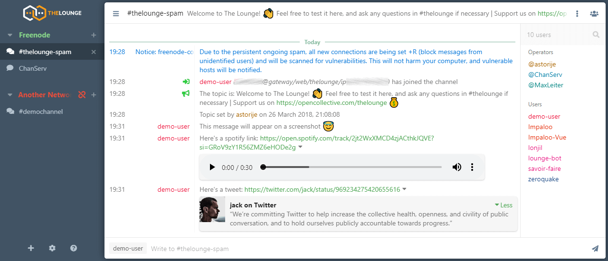

<!--
N.B.: This README was automatically generated by https://github.com/YunoHost/apps/tree/master/tools/README-generator
It shall NOT be edited by hand.
-->

# The Lounge for YunoHost

[](https://dash.yunohost.org/appci/app/thelounge)    
[](https://install-app.yunohost.org/?app=thelounge)

*[Lire ce readme en français.](./README_fr.md)*

> *This package allows you to install The Lounge quickly and simply on a YunoHost server.
If you don't have YunoHost, please consult [the guide](https://yunohost.org/#/install) to learn how to install it.*

## Overview

Web IRC client

**Shipped version:** 4.2.0~ynh3

**Demo:** https://demo.thelounge.chat/

## Screenshots



## Disclaimers / important information

## Configuration

How to configure this app: by an admin panel.

#### Multi-users support

* Are LDAP supported? **Yes**
* Can the app be used by multiple users? **Yes**

## Documentation and resources

* Official app website: https://thelounge.chat/
* Official admin documentation: https://thelounge.chat/docs
* Upstream app code repository: https://github.com/thelounge/thelounge
* YunoHost documentation for this app: https://yunohost.org/app_thelounge
* Report a bug: https://github.com/YunoHost-Apps/thelounge_ynh/issues

## Developer info

Please send your pull request to the [testing branch](https://github.com/YunoHost-Apps/thelounge_ynh/tree/testing).

To try the testing branch, please proceed like that.
```
sudo yunohost app install https://github.com/YunoHost-Apps/thelounge_ynh/tree/testing --debug
or
sudo yunohost app upgrade thelounge -u https://github.com/YunoHost-Apps/thelounge_ynh/tree/testing --debug
```

**More info regarding app packaging:** https://yunohost.org/packaging_apps