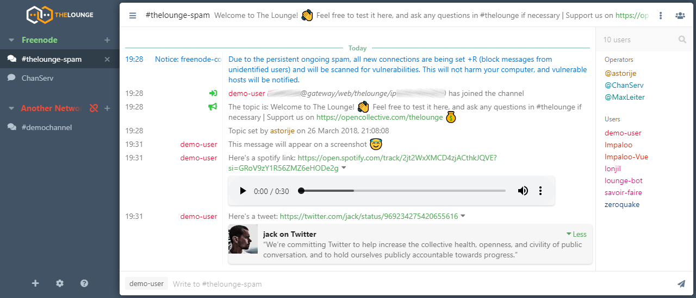

<!--
N.B.: Diese README wurde automatisch von <https://github.com/YunoHost/apps/tree/master/tools/readme_generator> generiert.
Sie darf NICHT von Hand bearbeitet werden.
-->

# The Lounge für YunoHost

[](https://ci-apps.yunohost.org/ci/apps/thelounge/)


[](https://install-app.yunohost.org/?app=thelounge)

*[Dieses README in anderen Sprachen lesen.](./ALL_README.md)*

> *Mit diesem Paket können Sie The Lounge schnell und einfach auf einem YunoHost-Server installieren.*  
> *Wenn Sie YunoHost nicht haben, lesen Sie bitte [die Anleitung](https://yunohost.org/install), um zu erfahren, wie Sie es installieren.*

## Übersicht

Modern web IRC client designed for self-hosting. 

### Features:

- Always connected
- Responsive interface
- Multi-user support


**Ausgelieferte Version:** 4.4.3~ynh5

**Demo:** <https://demo.thelounge.chat/>

## Bildschirmfotos



## Dokumentation und Ressourcen

- Offizielle Website der App: <https://thelounge.chat/>
- Offizielle Verwaltungsdokumentation: <https://thelounge.chat/docs>
- Upstream App Repository: <https://github.com/thelounge/thelounge>
- YunoHost-Shop: <https://apps.yunohost.org/app/thelounge>
- Einen Fehler melden: <https://github.com/YunoHost-Apps/thelounge_ynh/issues>

## Entwicklerinformationen

Bitte senden Sie Ihren Pull-Request an den [`testing` branch](https://github.com/YunoHost-Apps/thelounge_ynh/tree/testing).

Um den `testing` Branch auszuprobieren, gehen Sie bitte wie folgt vor:

```bash
sudo yunohost app install https://github.com/YunoHost-Apps/thelounge_ynh/tree/testing --debug
oder
sudo yunohost app upgrade thelounge -u https://github.com/YunoHost-Apps/thelounge_ynh/tree/testing --debug
```

**Weitere Informationen zur App-Paketierung:** <https://yunohost.org/packaging_apps>
